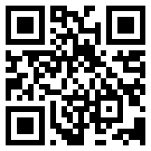

## Projekt 2: Grafika mobilna, grafika interaktywna

W ramach drugiego projektu można wykonać jedną z trzech możliwości:

A) Projekt **eksperyment 3**. Udział w eksprymentalnych warsztatach wspólnych z ASP i UW. Terminy warsztatów 26 XI, 17 XII i 21 I w godzinach 18 - 20. Do projektu można zgłaszać się do piątku 23 listopada - koniec dnia. Od 4 do 8 miejsc, decyduje kolejność zgłoszeń i wyniki wcześniejszych projektów/prac domowych.

B) Projekt **MiNI korzenie**. Celem jest opracowanie strony internetowej (interaktywnej lub statycznej) prezentującej związek pracowników z wydziału MiNI z Warszawską i Lwowską szkołą matematyczną. Strona https://genealogy.math.ndsu.nodak.edu/ umożliwia analizę genealogii osób (w sensie doktoratów). Szkoła lwowska: https://pl.wikipedia.org/wiki/Lwowska_szko%C5%82a_matematyczna, Szkoła warszawska: https://pl.wikipedia.org/wiki/Warszawska_szko%C5%82a_matematyczna. Tam gdzie to możliwe należy pokazać związek pomiędzy obecnymi pracownikami a członkami ww szkół matematycznych z okresu międzywojennego. Inspiracja: https://www.wired.com/wp-content/uploads/2014/10/st_mathancestry_f.jpg  http://revistapesquisa.fapesp.br/wp-content/uploads/2017/05/genealogy_249.jpg 

C) Projekt **JA**. Celem jest opracowanie strony internetowej (interaktywnej lub statycznej) opisującej aktywność autora/autorów przez pryzmat IoT lub SM (wearables - puls, kroki, inne dane, aktywność na facebook, twitter, mail itp). Przykłady inspiracji: https://flowingdata.com/2008/09/09/winner-of-the-personal-visualization-project-is/

Projekt wykonywać można w grupie do 3 osób. Nie można pracować ponownie ze współpracownikiem z projektu 1 ani z prezentacji.

**Kryteria oceny**

Za ten projekt można otrzymać od 0 do 20 punktów, z czego:

- 5 punktów uzyskuje się za estetykę całej strony www
- 5 punktów uzyskuje się za estetykę poszczególnych wykresów (przynajmniej 2 wykresy), 
- 5 punktów uzyskuje się przemyślaną interakcje/animacje na wykresach
- 5 punktów uzyskuje się za oryginalność i pomysłowość prezentowanych danych

**Termin na oddanie projektu**

Ostatni wykład z TWD - 23 I 2019 godzina 10:15. Do tego czasu projekty powinny być na GitHub. Każda grupa krótko (!!!) pokaże opracowany projekt.

